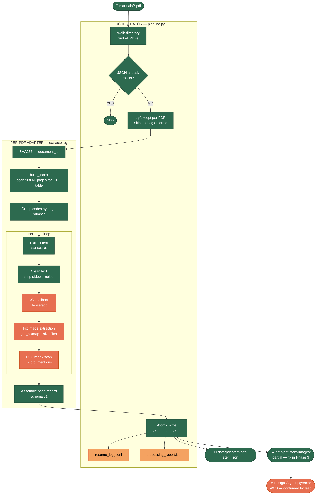

# ETL Pipeline Architecture

> Last updated: 2026-04-19

## Legend

| Colour | Meaning |
|---|---|
| 🟢 Green | Complete and working |
| 🟠 Orange | Must-have — not built yet |
| 🟡 Yellow | Nice-to-have — deferred |
| ⬜ Grey | Future phase — waiting on decision |

> **April 2026:** PostgreSQL + pgvector on AWS confirmed by lead. AWS Bedrock (LLM enrichment) confirmed but blocked by permissions — pending resolution.

---



---

## Deferred ideas

### Table image rendering

Tables are currently extracted as structured JSON (`raw_rows`, `reconstructed_rows`). It is also possible to save a visual PNG snapshot of each table alongside the structured data using PyMuPDF's page region rendering:

```python
rect = table.bbox          # bounding box from page.find_tables()
pix  = page.get_pixmap(clip=rect, dpi=150)
pix.save(output_dir / f"{page_ref}-table{idx}.png")
```

This would let the importer show a human-readable view of each table, or feed it to a vision model for verification. Not needed for the current importer pipeline — deferred until there is a concrete use case.
